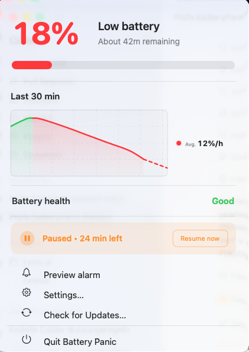

# Battery Panic <sub><a href="https://leontofficial.github.io/BatteryPanic/">Website</a></sub>


Battery Panic is a native macOS menu bar app that makes low battery warnings impossible to miss. When your MacBook drops below your chosen battery threshold, Battery Panic shows a red pulsing screen overlay, plays an optional warning sound, and keeps the status visible in the menu bar. Its native dashboard also shows real battery health, remaining time, and a private local history chart.

The app is built with Swift and AppKit, stays local to your Mac, and is designed as a clean open-source project rather than a one-file demo.

Battery Panic is intentionally a menu bar app. It does not install a separate
Notification Center or WidgetKit widget.


## Download & Install

For normal users, download the finished DMG below. Do **not** use GitHub's **Code -> Download ZIP** button at the top of the repository, because that downloads the source code, not the finished app.

**Latest app download:**

- [Download Battery Panic 0.6.0 DMG](https://github.com/LeonTOfficial/BatteryPanic/releases/download/v0.6.0/Battery.Panic.0.6.0.dmg)
- [All releases and fallback ZIP](https://github.com/LeonTOfficial/BatteryPanic/releases)

Use `Battery.Panic.0.6.0.zip` only as a fallback if the DMG does not work.

DMG install:

1. Download the DMG from the link above.
2. Open the DMG.
3. Drag `Battery Panic.app` into **Applications**.
4. Open Battery Panic from **Applications**.
5. If macOS blocks the first launch, use the `Open Privacy & Security` shortcut inside the DMG or the link below.

ZIP fallback:

1. Download the ZIP from the release page above.
2. Unzip it.
3. Move `Battery Panic.app` into **Applications**.
4. Open Battery Panic from **Applications**.

Battery Panic is currently open source and ad-hoc signed, but not notarized by Apple yet. macOS may show a message such as **“Battery Panic cannot be opened because the developer cannot be verified.”**

To open it without Terminal:

1. Click [Open Privacy & Security settings](x-apple.systempreferences:com.apple.settings.PrivacySecurity.extension).
2. Scroll all the way down.
3. Find the message that Battery Panic was blocked.
4. Click **Open Anyway** / **Dennoch öffnen**.
5. Confirm **Open** if macOS asks again.

If the direct settings link does not open, open **System Settings -> Privacy & Security** manually and scroll to the bottom.


This happens because Battery Panic is not Apple-notarized yet. Removing this warning completely requires Apple Developer ID signing and notarization, which is planned for a later public distribution step.

If Battery Panic opens but no icon appears in the menu bar:

1. Open **System Settings**.
2. Go to **Control Center -> Menu Bar**.
3. Find **Battery Panic**.
4. Turn the switch on.

macOS can hide third-party menu bar apps here. When this switch is off, Battery Panic may still be running, but its battery icon will not appear in the menu bar.

See the full install guide: [`docs/INSTALL.md`](docs/INSTALL.md).

## Features

- Native macOS menu bar app.
- Native menu dashboard with real battery percentage, remaining time, power state, health, and alarm state.
- Private on-device battery history with 30-minute, one-hour, one-day, and one-week views.
- Smooth history chart with exact hover values, average drain, short forecast, and real charging segments.
- Green, orange, red, and charging-aware menu bar battery states.
- Red percentage-only menu bar pulse while a low-battery alarm is paused for 30 minutes.
- Red pulsing full-screen overlay across connected displays.
- Estimated battery time in the red warning overlay when macOS provides it.
- Adjustable low-battery threshold.
- Charging reminder while plugged in, enabled by default at 80%.
- Automatic critical mode at 2% or below with stronger warning text and glow.
- Adjustable overlay pulse speed and pulse intensity.
- Built-in continuous Battery Panic siren plus selectable macOS system warning sounds.
- Test buttons for both the red overlay and the selected sound.
- Live in-settings overlay preview that updates while you move pulse controls.
- Fixed short 4-second red-screen preview for safe testing.
- Secure Sparkle 2.9.5 updates with daily checks and automatic background installation when macOS permits it.
- Manual **Check for Updates...** action remains available in the menu bar.
- Optional launch at login.
- First-run welcome/setup window.
- Privacy-friendly behavior: no analytics, no accounts, no system profiling, and network access only for Sparkle update delivery.
- Custom app icon and README preview assets generated from source scripts.

## Screenshots




## Usage

1. Open Battery Panic.
2. The first-run setup window appears.
3. Choose whether the app should start at login.
4. Click **Preview 4s Alarm** to test the visual warning.
5. Open **Settings** from the menu bar item to adjust threshold, overlay, and sound behavior.

Battery Panic shows the red warning when the Mac has a battery, is unplugged, and the current percentage is at or below your configured threshold. At 2% or below, the app automatically switches to a stronger critical warning.

The charging reminder is separate: when enabled, it shows one short green/blue reminder while the Mac is plugged in and reaches your chosen charging percentage. It resets after unplugging or after the battery drops clearly below that level again.

## Settings

- **Battery threshold:** default is 10%, adjustable from 1% to 50%.
- **Charging reminder:** default is enabled at 80%, adjustable from 50% to 100%.
- **Pulse red overlay:** enables or disables the animated overlay pulse.
- **Pulse speed:** controls how fast the warning breathes.
- **Pulse intensity:** controls how strong the red wash and glow are.
- **Warning sound:** choose the built-in Battery Panic Siren or macOS system sounds such as Basso, Ping, Glass, Hero, and more. Warning sounds can repeat during a real alarm until the alert ends.
- **Test Sound:** plays the selected warning sound immediately.
- **Preview Red Screen / Preview 4s Alarm:** shows the overlay for about four seconds using a safe simulated low-battery state.
- **Start at login:** registers Battery Panic as a macOS login item.
- **Pause alarm:** temporarily disables real low-battery warnings for 30 minutes. After that, Battery Panic automatically turns the alarm back on.

## Updates

Battery Panic includes Sparkle update support. After installing a Sparkle-enabled version, users can choose **Check for Updates...** from the menu bar item instead of downloading every new version manually.

For release setup, see [`docs/UPDATES.md`](docs/UPDATES.md).

## Security and Privacy

Battery Panic is local-first:

- No analytics.
- No telemetry.
- No tracking.
- No account required.
- No network connection is needed for the battery warning itself.
- Battery history is retained locally for no more than seven days and is never uploaded.
- Optional update checks contact the configured Sparkle appcast on GitHub.
- No API keys or tokens.
- No private user data collection.

The app reads battery status through macOS power APIs and can optionally register itself as a login item. The red overlay appears only after login; macOS does not allow a normal app to draw over the lock screen or before the user session starts.

Read more in [`SECURITY.md`](SECURITY.md).

## macOS Compatibility

- Minimum supported macOS version: macOS 13.
- Tested in this workspace with Xcode 26.5 and Swift 6.3.2.
- Apple Silicon build output is generated by the local toolchain.
- Current public packages are ad-hoc signed Apple Silicon builds and are not Apple-notarized.

## Development

Run the focused logic tests:

```bash
chmod +x scripts/run_tests.sh
./scripts/run_tests.sh
```

Build the app:

```bash
./scripts/build_app.sh
```

The build script signs the app in a temporary staging folder, verifies it, then writes the local app bundle, GitHub-friendly ZIP package, and user-friendly DMG package into `outputs/`.

For publishing, release fields, and recommended GitHub security settings, see [`docs/GITHUB_RELEASE_GUIDE.md`](docs/GITHUB_RELEASE_GUIDE.md).

Open the project in Xcode:

```bash
open Package.swift
```

Use the `BatteryPanicApp` scheme for the app. More details: [`docs/XCODE.md`](docs/XCODE.md).

Generate the app icon and README screenshots:

```bash
swift scripts/create_icon.swift
swift scripts/create_readme_screenshots.swift
```

Project layout:

```text
Sources/BatteryPanicApp/
├── App/
├── Battery/
├── MenuBar/
├── Overlay/
├── Settings/
├── Shared/
└── Sound/
```

## Credits

Created by Leon.

- GitHub: [LeonTOfficial](https://github.com/LeonTOfficial)
- Discord: [Battery Panic / LeonTOfficial](https://discord.gg/JPjrw3ft)
- Inspired by the clean, local-first project style used in [LeonAI](https://github.com/LeonTOfficial/LeonAI).

If Battery Panic helps you, I would be very happy about feedback or a GitHub star. It supports the project and motivates me to keep improving it.

## License

Battery Panic is released under the MIT License. See [`LICENSE`](LICENSE).

The MIT License requires that the copyright notice and permission notice stay included in copies or substantial portions of the software. In practice, that means redistributions of the source code should keep the attribution to Leon / LeonTOfficial.
