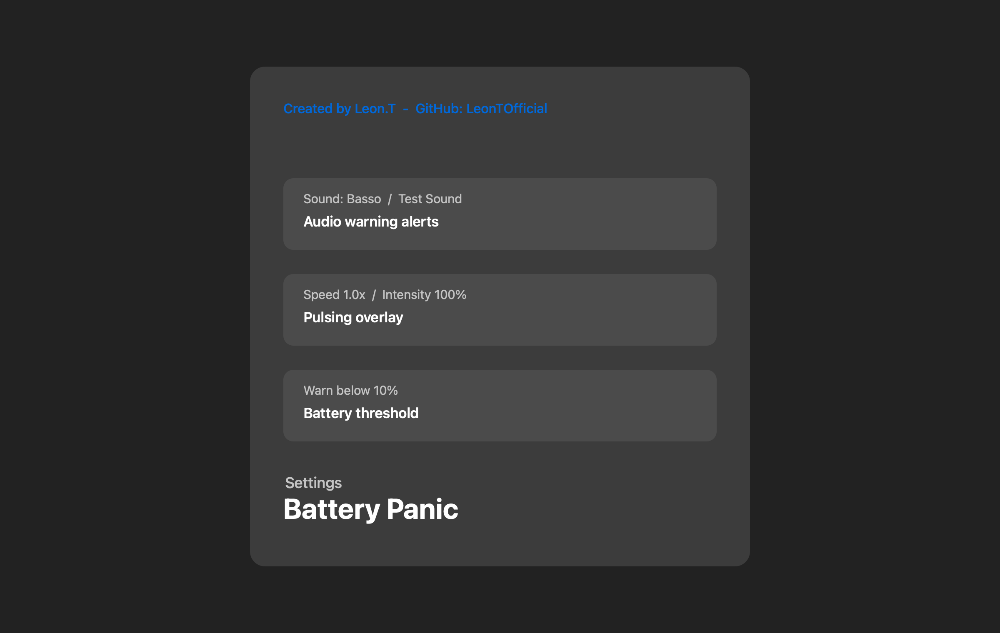

# Battery Panic


Battery Panic is a native macOS menu bar app that makes low battery warnings impossible to miss. When your MacBook drops below your chosen battery threshold, Battery Panic shows a red pulsing screen overlay, plays an optional warning sound, and keeps the status visible in the menu bar.

The app is built with Swift and AppKit, stays local to your Mac, and is designed as a clean open-source project rather than a one-file demo.

## Features

- Native macOS menu bar app.
- Green, orange, red, and charging-aware menu bar battery states.
- Red pulsing full-screen overlay across connected displays.
- Adjustable low-battery threshold.
- Adjustable overlay pulse speed and pulse intensity.
- Built-in repeating Battery Panic siren plus selectable macOS system warning sounds.
- Test buttons for both the red overlay and the selected sound.
- Live in-settings overlay preview that updates while you move pulse controls.
- Fixed short 4-second red-screen preview for safe testing.
- Optional launch at login.
- First-run welcome/setup window.
- Local-only behavior: no analytics, no network calls, no accounts.
- Custom app icon and README preview assets generated from source scripts.

## Screenshots




## Installation

### Option 1: Build Locally

Requirements:

- macOS 13 or newer.
- Xcode 26.5 or Swift command-line tools.

Build the app bundle:

```bash
chmod +x scripts/build_app.sh
./scripts/build_app.sh
```

The finished app and release package are created at:

```text
outputs/Battery Panic.app
outputs/Battery Panic 0.4.0.zip
```

Open it from Finder or run:

```bash
open "outputs/Battery Panic.app"
```

If macOS blocks the first launch because the app is locally signed, right-click the app and choose **Open**.

### Option 2: Open in Xcode

Open `Package.swift` in Xcode, select the `BatteryPanicApp` scheme, choose **My Mac**, and press Run.

## Usage

1. Open Battery Panic.
2. The first-run setup window appears.
3. Choose whether the app should start at login.
4. Click **Preview 4s Alarm** to test the visual warning.
5. Open **Settings** from the menu bar item to adjust threshold, overlay, and sound behavior.

Battery Panic only shows the real warning when the Mac has a battery, is unplugged, and the current percentage is at or below your configured threshold.

## Settings

- **Battery threshold:** default is 10%, adjustable from 1% to 50%.
- **Pulse red overlay:** enables or disables the animated overlay pulse.
- **Pulse speed:** controls how fast the warning breathes.
- **Pulse intensity:** controls how strong the red wash and glow are.
- **Warning sound:** choose the built-in Battery Panic Siren or macOS system sounds such as Basso, Ping, Glass, Hero, and more.
- **Test Sound:** plays the selected warning sound immediately.
- **Preview Red Screen / Preview 4s Alarm:** shows the overlay for about four seconds using a safe simulated low-battery state.
- **Start at login:** registers Battery Panic as a macOS login item.
- **Pause alarm:** temporarily disables real low-battery warnings.

## Security and Privacy

Battery Panic is local-first:

- No analytics.
- No telemetry.
- No network requests.
- No API keys or tokens.
- No private user data collection.

The app reads battery status through macOS power APIs and can optionally register itself as a login item. The red overlay appears only after login; macOS does not allow a normal app to draw over the lock screen or before the user session starts.

Read more in [`SECURITY.md`](SECURITY.md).

## macOS Compatibility

- Minimum supported macOS version: macOS 13.
- Tested in this workspace with Xcode 26.5 and Swift 6.3.2.
- Apple Silicon build output is generated by the local toolchain.

## Development

Run the focused logic tests:

```bash
chmod +x scripts/run_tests.sh
./scripts/run_tests.sh
```

Build the app:

```bash
./scripts/build_app.sh
```

The build script signs the app in a temporary staging folder, verifies it, then writes both the local app bundle and a GitHub-friendly zip package into `outputs/`.

For publishing, release fields, and recommended GitHub security settings, see [`docs/GITHUB_RELEASE_GUIDE.md`](docs/GITHUB_RELEASE_GUIDE.md).

Generate the app icon and README screenshots:

```bash
swift scripts/create_icon.swift
swift scripts/create_readme_screenshots.swift
```

Project layout:

```text
Sources/BatteryPanicApp/
├── App/
├── Battery/
├── MenuBar/
├── Overlay/
├── Settings/
├── Shared/
└── Sound/
```

## Credits

Created by Leon.

- GitHub: [LeonTOfficial](https://github.com/LeonTOfficial)
- Inspired by the clean, local-first project style used in [LeonAI](https://github.com/LeonTOfficial/LeonAI).

If Battery Panic helps you, I would be very happy about feedback or a GitHub star. It supports the project and motivates me to keep improving it.

## License

Battery Panic is released under the MIT License. See [`LICENSE`](LICENSE).

The MIT License requires that the copyright notice and permission notice stay included in copies or substantial portions of the software. In practice, that means redistributions of the source code should keep the attribution to Leon / LeonTOfficial.
